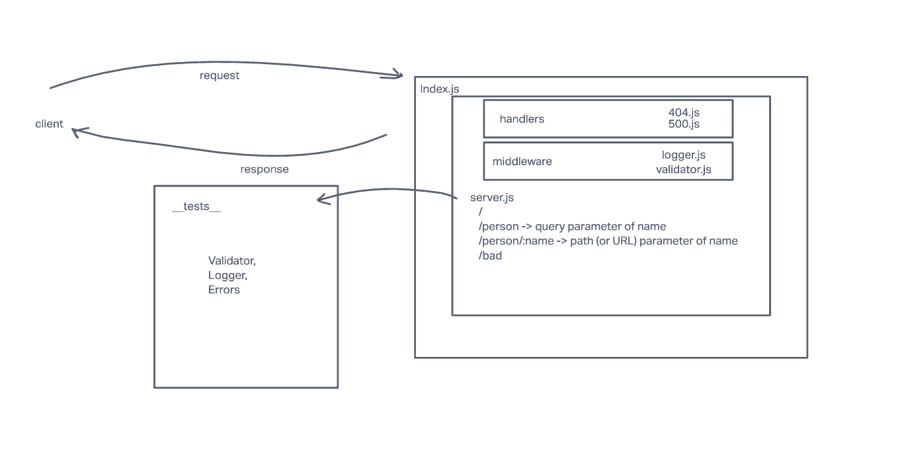

# Lab Class 01

## Project: Basic-express-server

Create a basic express server

### Author: Raphael Chookagian

### Problem Domain

Create a web server and utilize CI and CD and get practice in the general process of building and deploying servers, and prepping work for grading

### Links and Resources

- [ci,cd](https://github.com/cesarderio/basic-express-server)
- [prod deployment](https://basic-express-server-tg63.onrender.com)
<!-- - [dev deployment](https://server-dev-6rxb.onrender.com/) -->

### Setup

### `.env` requirements

see `.env.sample`

i.e.

- `PORT`
- `DATABASE_URL` - URL to the running Postgres instance/db

#### How to initialize/run your application (where applicable)

- nodemon

#### Features / Routes

- Feature One: Details of feature
- GET : `/` - specific route to hit
- GET : `/person` - specific route to hit
- GET : `bad` - specific route to hit

#### Tests

- How do you run tests?
  - npm test
- Any tests of note?
  - validator
  - logger
  - handles root path
  - handles errors
  handles invalid requests

### Whiteboard

#### UML

Link to an image of the UML for your application and response to events

## Terminology

- Query Parameter: `/person?name=Raphael`
- Path (URL) Parameter: `/person/name`
